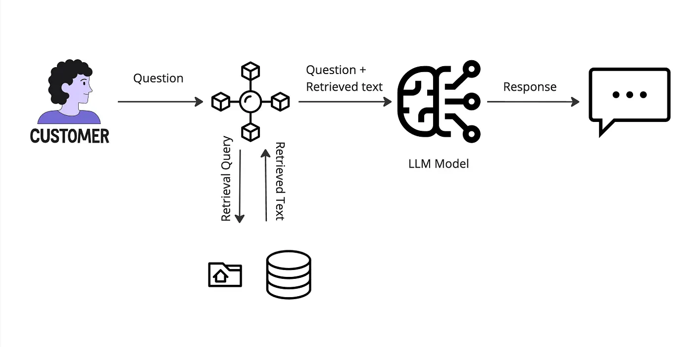
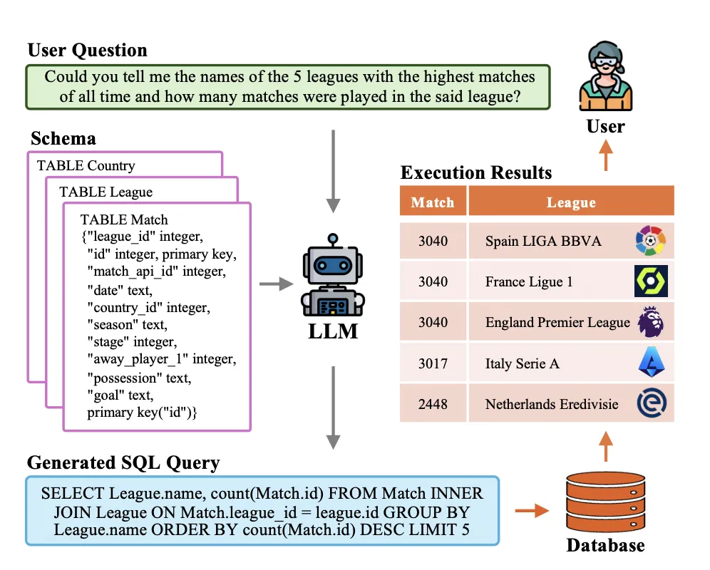

# LLM‑Powered Text-to-SQL: Natural Language to Executable SQL
> Part of **CSCI 544 Applied Natural Language
Processing at University of Southern California** · 📄 Final Presentation: `assets/Final_Presentation.pdf` 📄 Final Report: `assets/Final_Report.pdf`

Talk to your data like a human. This **schema-aware Text-to-SQL (T2S)** system converts natural language into **correct, executable SQL**—with a modular pipeline, strong validation, and **local, cost-efficient inference**.

This project presents a schema-aware Text-to-SQL (T2S) system that translates natural language questions into executable SQL queries. The system is architected as a robust FastAPI service that leverages multiple Large Language Models (LLMs) for high accuracy and is optimized for efficient, cost-effective local inference.

The core methodology achieves **81% execution accuracy** on the complex, multi-table **Spider** benchmark. This work bridges the gap between theoretical research and practical deployment by creating a system that is not only accurate but also scalable and user-friendly.

---

## 🌟 Key Features

* **High-Accuracy SQL Generation**: Utilizes a fine-tuned **SQLCoder-7B** model, building on foundational research with T5 and BART models, to generate syntactically and semantically correct SQL.
* **Dynamic Semantic Schema Matching**: Employs **Sentence-BERT (SBERT)** to intelligently match a user's question to the most relevant database schema from over 35 candidates, achieving **over 90% accuracy** in schema selection.
* **Multi-Layer Validation Pipeline**: Ensures query reliability through a comprehensive validation process, including initial syntax checks (`sqlparse`), schema compliance, and a final execution check against a **SQLite** engine to verify correctness.
* **Optimized for Local Inference**: Uses **GGUF quantization** to run the powerful 7B parameter model efficiently on local hardware, drastically reducing operational costs compared to API-based solutions.
* **Production-Grade API**: Built with **FastAPI**, the system exposes clean, RESTful endpoints for schema matching, SQL generation, and query execution, with robust error handling and logging.
* **Proven on Complex Benchmarks**: The system's effectiveness was validated on the **WikiSQL** and **Spider** datasets, demonstrating its ability to handle both simple and complex multi-table database structures.

---

## 🏗️ System Architecture

The system employs a modular pipeline that processes a natural language question through several stages to ensure the final SQL query is accurate, relevant, and executable.

1. **Semantic Schema Matching**: The user's question is first encoded into a dense vector embedding using **Sentence-BERT (`all-MiniLM-L6-v2`)**. This embedding is compared against pre-computed embeddings of all available database schemas using cosine similarity to find the most relevant one.
2. **Schema-Aware Prompt Engineering**: The identified schema is formatted using custom **XML-like tags (`<tab>`, `<col>`)** and concatenated with the original question. This technique provides critical structural context to the LLM, reducing errors and hallucinations.
3. **LLM-Based SQL Generation**: The structured prompt is sent to a locally deployed **SQLCoder-7B (GGUF)** model, which generates the SQL query. The decoding strategy uses **beam search** to enhance syntactic accuracy.
4. **Validation and Execution**: The generated SQL undergoes a final check for syntactic validity and is then executed against a live **SQLite** database to confirm it runs without errors and produces a valid result.

---

## 📊 Performance & Evaluation

* **Execution Accuracy (Spider)**: **81%**  
* **Exact Match Accuracy (WikiSQL)**: **70.16%** (using CodeT5-base)  
* **Schema Selection Accuracy**: **>90%**  

---

## 🛠️ Technical Stack

| Category           | Technologies                                                                                             |
| ------------------ | -------------------------------------------------------------------------------------------------------- |
| **Backend** | `FastAPI`, `Python 3.11+`, `SQLAlchemy`                                                                  |
| **ML/NLP** | `SQLCoder-7B (GGUF)`, `Sentence-Transformers`, `T5`, `BART`, `llama-cpp-python`, `Hugging Face Transformers` |
| **Database** | `SQLite`, `PostgreSQL`                                                                                   |
| **Tools & DevOps** | `sqlparse`, `NLTK`, `Faker` (for synthetic data), `GGUF Quantization`                                      |

---

## 🚀 Quickstart

Prereqs: Python 3.11+, `uvicorn`. A GPU is nice but not required for GGUF CPU inference.

1) Clone and enter:
    git clone <your-repo-url>
    cd text-to-sql

2) Install:
    python -m venv .venv && source .venv/bin/activate
    pip install -r requirements.txt

3) Models & embeddings (examples):
    - place your GGUF model in ./models/sqlcoder-7b.gguf
    - download SBERT locally via sentence-transformers
    python scripts/precompute_schema_embeddings.py --schemas ./schemas --out ./artifacts/schema_index.pkl

4) Run API:
    uvicorn app.main:app --host 0.0.0.0 --port 8000 --reload. Open: localhost:8000/docs for interactive Swagger.

---

## 🔌 API (FastAPI)

POST /match-schema — Given a question, returns the most relevant schema (tables + columns) using SBERT cosine similarity.

Body:
    { "question": "List the top 5 customers by total order value" }

Response:
    {
      "db_id": "sales_db",
      "tables": [{"name": "orders", "columns": ["id", "customer_id", "amount", "created_at"]}, ...],
      "confidence": 0.93
    }

POST /generate-sql — Generates SQL using schema-aware prompting (with <tab>, <col>).

Body:
    {
      "question": "List the top 5 customers by total order value",
      "schema": { "db_id": "sales_db", "tables": [...schema here...] }
    }

Response:
    { "sql": "SELECT c.name, SUM(o.amount) AS total FROM ... ORDER BY total DESC LIMIT 5;" }

POST /execute — Runs a SQL string against SQLite (or Postgres if configured) with validation.

Body:
    { "db_id": "sales_db", "sql": "SELECT ...;" }

Response:
    { "columns": ["name", "total"], "rows": [["Alice", 12345.67], ["Bob", 11800.10], ...] }

---
